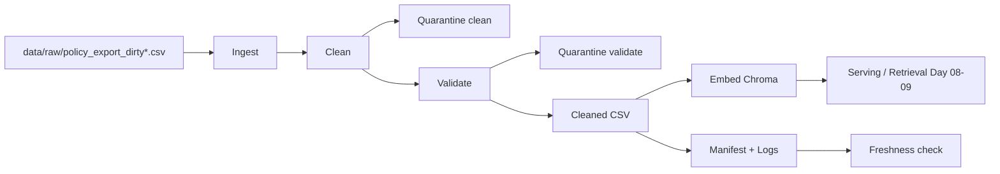

# Kien truc pipeline - Lab Day 10

**Nhom:** ___________
**Cap nhat:** `2026-04-15`

## 1. So do luong

Data quality gates:

- Sau ingest/clean: unknown `doc_id`, `missing_effective_date`, stale HR effective date, duplicate chunk di vao quarantine.
- Sau validate: chunk ngan, stale refund con sot, timestamp sai dinh dang, duplicate doc+chunk bi chan truoc khi embed.
- Sau publish: manifest giu `run_id`, record counts, metric impact, `latest_exported_at`.

## 2. Ranh gioi trach nhiem

| Thanh phan | Input | Output | Owner nhom |
|------------|-------|--------|------------|
| Ingest | Raw CSV | `raw_records`, raw rows | Ingestion Owner |
| Transform | Raw rows | Cleaned rows + clean metrics | Cleaning / Quality Owner |
| Quality | Cleaned rows | Validation quarantine + expectation results | Cleaning / Quality Owner |
| Embed | Cleaned CSV | Chroma collection `day10_kb` | Embed Owner |
| Monitor | Manifest, logs, eval CSV | Freshness status, report evidence | Monitoring / Docs Owner |

## 3. Idempotency & rerun

Pipeline embed theo snapshot publish:

- `chunk_id` duoc tao on dinh tu `doc_id + chunk_text + seq`
- Chroma `upsert(ids=chunk_id, ...)` de rerun khong tao duplicate vector
- Truoc khi upsert, pipeline `delete` nhung `ids` khong con ton tai trong cleaned run hien tai

He qua:

- Chay lai cung input khong lam phinh vector store
- Chuyen tu `inject-bad` ve `normal` se prune stale chunk khoi collection
- `hits_forbidden` co the duoc cai thien sau rerun ma khong can reset tay Chroma

## 4. Lien he Day 09

Collection `day10_kb` la corpus da qua clean/validate de cap lai retrieval cho bai Day 09. Day 10 khong thay doi orchestration cua Day 09, nhung lam cho agent doc dung version hon bang cach loai stale policy va ghi lai boundary publish ro rang.

## 5. Rui ro da biet

- Freshness cua bo du lieu mau dang vuot SLA 24h, nen manifest hien `FAIL`.
- Khi may khong co mang, can dat `HF_HUB_OFFLINE=1` va `TRANSFORMERS_OFFLINE=1` de dung cache local cua model embed.
- Top-1 retrieval co the van dung trong khi top-k da bi nhiem stale context, nen phai theo doi `hits_forbidden`.
